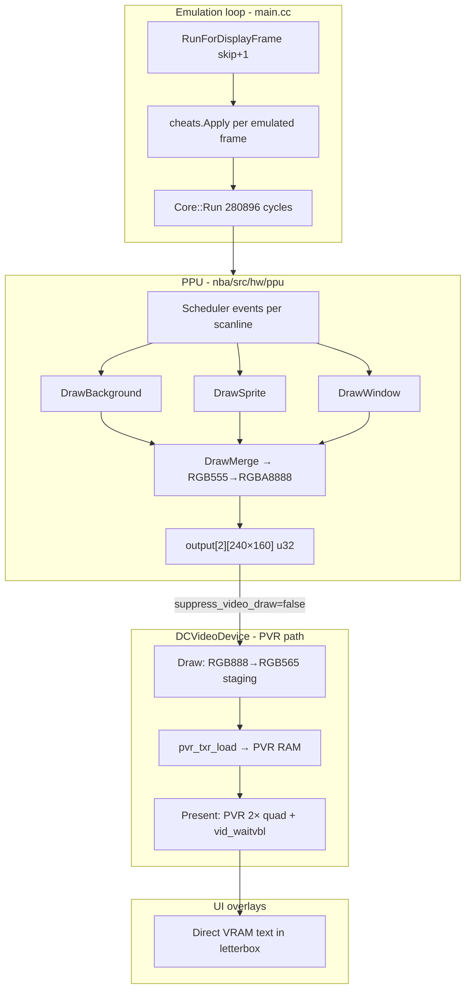

# PPU / GPU Overhaul Plan — Maximum Dreamcast Performance

This document combines and supersedes scattered performance notes from `ROADMAP.md`,
`DREAMCAST.md`, `COMPATIBILITY.md`, and the Milestone 3 tuning passes (PR #20 and
related commits). It is the single plan for **software PPU** and **Dreamcast GPU
(PVR / presentation)** work aimed at holding ~59.7 display FPS on retail hardware
for the heaviest GBA titles.

Related docs:

- [`ROADMAP.md`](ROADMAP.md) — milestone tracking
- [`DREAMCAST.md`](DREAMCAST.md) — user settings, profiles, benchmark workflow
- [`COMPATIBILITY.md`](COMPATIBILITY.md) — per-game results and host CI baselines

---

## 1. Goals and non-goals

### Goals

1. **Sustain ~59.7 display FPS** on stock Dreamcast (200 MHz SH4, 16 MB RAM) for
   sprite-heavy and Mode-7 / bitmap-heavy games at the **Speed** profile, and for
   a wider set at **Balanced**.
2. **Minimize work per presented frame** — PPU rasterization, color conversion, and
   PVR upload/present must scale with *display* rate, not raw emulated frame rate.
3. **Keep timing-sensitive behavior correct** — IRQs, DMA, scanline counters, and
   audio sync must remain stable under frame skip and fast paths.
4. **Measure everything** — FPS, `EF` (emulated FPS), `PG` (ROM page misses),
   and new GPU-centric counters (see §7) on fixed retail scenes.

### Non-goals (Dreamcast retail)

| Item | Reason |
|------|--------|
| OpenGL shader pipeline (`ogl_video_device`) | No GL on DC; LCD ghosting / xBRZ / color matrices stay desktop-only |
| Multi-threaded PPU + CPU | Single-threaded main loop is a deliberate constraint |
| Full PPU HLE (replace software rasterizer) | Too game-specific; frame skip + fast paths are the pragmatic approach |
| 480×320 software CPU upscale | Replaced by PVR quad (commit `d22ca3d2`); keep only as fallback |

---

## 2. Current architecture (as built)



### Data path cost (presented frame)

| Stage | Format | Approx. work |
|-------|--------|----------------|
| Merge write | GBA RGB555 → **RGBA8888** | Per visible pixel, cycle-stepped |
| `ConvertFrameToTexture` | RGBA8888 → **RGB565** | 38,400 px × LUT lookup |
| `pvr_txr_load` | Staging → PVR VRAM | 256×160×2 bytes DMA-style copy |
| `RenderScaledFramePvr` | Textured quad 240→480 × 160→320 | GPU (cheap vs CPU blit) |
| UI overlays | RGB565 VRAM writes | Margins only |

### Frame skip (display vs emulated)

`RunForDisplayFrame(N)` runs **N suppressed** emulated frames + **1 presented** frame.

On suppressed frames (`config.suppress_video_draw = true`):
PPU raster timestamps and affine scroll still advance each scanline (no pixel
compositing or `video_dev->Draw()`).

- Skips: `DrawBackground`, `DrawMerge`, `DrawWindow`, `DrawSprite`, sprite init/swap,
  background/merge/window init, `video_dev->Draw()`
- Keeps: scheduler timing, vcount, IRQ/DMA, video DMA latch logic

Auto frame skip (Speed profile) raises/lowers N from measured **display** FPS.

Overlay / logs: `FPS`, `EF` (= FPS × (N+1)), `FS`/`FSA`, `PG`.

---

## 3. Completed work (inventory)

Use this as the baseline — do not re-plan solved problems.

### PPU / presentation (already shipped)

- [x] PVR hardware 2× scale instead of CPU nearest-neighbor blit (`d22ca3d2`)
- [x] `suppress_video_draw` gates final `video_dev->Draw()` (PVR upload)
- [x] Skip PPU scanline rasterization on suppressed frames (`e3e63173`)
- [x] Skip sprite fetch/init and BG/merge/window init on suppressed frames
- [x] `RunForDisplayFrame` batches skip + present (`eb5c5580`)
- [x] Auto frame skip UI + Speed-profile tuning (56/58.5 FPS thresholds)
- [x] RGB565 conversion via 32K LUT (`dc_video_device`)
- [x] Clear stride padding once at init instead of per presented frame
  (padding columns are never sampled: `uv_clamp` + `u_max = 240/256`)
- [x] Hoist present-quad geometry/UV to compile-time constants (no per-frame divides)
- [x] Asynchronous TA-DMA texture upload (`pvr_txr_load_dma`, cache-flushed,
  awaited before scene submit) with automatic blocking-`pvr_txr_load` fallback

### Adjacent (feeds GPU budget, not PPU itself)

- [x] Idle-loop elimination (`game_config.txt`)
- [x] MP2K HLE + body skip (Speed audio)
- [x] Paged-ROM cache, prefetch, `PG` telemetry
- [x] Host benchmark + CI smoke (`scripts/dc-host-benchmark.sh`)

### Explicitly deferred (DREAMCAST.md limitations)

- LCD ghosting, color correction, xBRZ — desktop `OGLVideoDevice` only
- Cheats/hooks that patch video — unchanged

---

## 4. Bottleneck analysis

### Where time goes on heavy scenes (expected retail)

1. **PPU merge + background + sprites** — cycle-accurate scanline stepping dominates
   when `suppress_video_draw = false`.
2. **RGBA8888 merge output** — expands GBA 15-bit color to 32-bit; second pass in
   `ConvertFrameToTexture` shrinks back to 565.
3. **Texture upload** — full 82 KiB stride buffer (`256×160×2`) every presented frame.
4. **PVR scene overhead** — `pvr_wait_ready`, `pvr_scene_begin/finish` per Present.
5. **Frame skip policy** — running N+1 emulated frames per display frame increases
   CPU work when N rises; wins only if suppressed frames are *much* cheaper than
   full raster (validated on hardware, not idle-loop CI ROMs).

### Host CI blind spot

`test.gba` / `kirby.gba` fixtures are **idle loops** (~60 FPS on desktop). They do
**not** stress PPU or PVR paths. Retail benchmark ROMs (sprite / Mode-7 / bitmap) are
**blocking** for validating this plan.

---

## 5. Unified phased plan

Phases are ordered by **risk × payoff**. Each phase has measurable exit criteria.

### Phase A — Measurement foundation (prerequisite)

**Goal:** Know which stage to attack on real hardware.

| Task | Detail |
|------|--------|
| A.1 | Lock **retail** benchmark ROMs + scenes in `COMPATIBILITY.md` (slots 2–4) |
| A.2 | Record Accuracy / Balanced / Speed FPS + `EF` + `PG` for each scene on DC |
| A.3 | Add optional **GPU segment timers** (Dreamcast-only, `show_fps` or env flag): `PPU`, `CONV`, `PVR`, `PRESENT` microseconds per displayed frame |
| A.4 | Add **presented-frame counter** vs emulated-frame counter in runtime log |

**Exit:** Table in `COMPATIBILITY.md` with retail numbers; one heavy scene shows which
segment exceeds budget (target: &lt;16.7 ms total per display frame at Speed).

### Phase B — PPU output format (high payoff, medium risk)

**Goal:** Remove the RGBA8888 middleman for Dreamcast.

| Task | Detail |
|------|--------|
| B.1 | Add `Config::video_pixel_format` or Dreamcast-only device flag: `RGBA8888` (default) vs `RGB565` |
| B.2 | **Fast path in `DrawMergeImpl`**: write RGB565 directly to `output565[frame]` when target is DC video device (or always on `PLATFORM_DREAMCAST`) |
| B.3 | Reuse 32K RGB555→RGB565 table (inverse of current merge `RGB555()` expand) |
| B.4 | `DCVideoDevice::Draw(u16* buffer)` overload — skip `ConvertFrameToTexture` |
| B.5 | Keep RGBA path for Qt/desktop |

**Exit:** Presented-frame conversion cost → ~0 ms in GPU timer; no visual regression
on benchmark scenes vs Phase A captures.

**Risk:** Blend / alpha / forced-blank paths must be audited per pixel in merge.

### Phase C — PPU fast raster (high payoff, higher risk)

**Goal:** Cheaper software raster when fidelity allows.

| Task | Detail |
|------|--------|
| C.1 | **`ppu_fast_mode` tied to Speed profile** (or new “Performance: Turbo” sub-flag) |
| C.2 | **Scanline batching**: for text modes 0–1, process full scanline in one `DrawBackgroundImpl` call when MOSAIC/window/affine state unchanged mid-line |
| C.3 | **Mode 3/4/5 fast paths**: memcpy-style bitmap rows instead of per-cycle merge stepping |
| C.4 | **Sprite fast path**: when OAM count &lt; threshold and no rotation/scaling, simplified fetch |
| C.5 | **SH4 tuned inner loops** for merge and BG (aligned reads, dual-pixel stores) |
| C.6 | Optional: skip greenswap / blend when DISPCNT says off (template specialization) |

**Exit:** Speed profile on **sprite-heavy** retail scene gains ≥15% display FPS vs
Phase A at same frame-skip setting; no game-breaking reports in compatibility table.

**Risk:** Mid-scanline IO changes (MOSAIC, window, DISPCNT latch) — fast paths must
fall back to cycle stepping when hardware would observe a change.

### Phase D — GPU / PVR presentation (medium payoff, lower risk)

**Goal:** Minimize per-presented-frame GPU CPU work.

| Task | Detail |
|------|--------|
| D.1 | **Write directly into PVR texture memory** where cache-coherent — eliminate staging + `pvr_txr_load` copy if KOS allows mapped write |
| D.2 | Evaluate **twiddled** vs stride texture: twiddle may help PVR sampling; measure upload cost both ways |
| D.3 | **Amortize PVR state**: precompiled poly header (done), reuse scene, avoid redundant `pvr_wait_ready` if nothing submitted |
| D.4 | **Upload only dirty rows** if partial updates ever feasible (unlikely for GBA full frames — document as “probably skip”) |
| D.5 | **Double-buffer PVR texture** — upload to back texture while front displays (if async TA possible on DC) |
| D.6 | Keep **software `DrawSoftwareScaled` fallback** when `pvr_init` fails |

**Exit:** `PVR` + `PRESENT` timer sum &lt; 2 ms on retail at 480×320; no tearing vs
current `vid_waitvbl` behavior.

#### Phase D evaluation outcomes

| Task | Outcome | Rationale |
|------|---------|-----------|
| D.1 | **Done (staging + SQ/DMA)** | Per-pixel writes to PVR VRAM are uncached and slow; the staging buffer + `pvr_txr_load` (store queue) / `pvr_txr_load_dma` (TA DMA) is the correct path. Direct mapped write is not a win. |
| D.2 twiddle | **Evaluated → deferred (likely regression)** | Twiddled textures cannot use stride, so the 240×160 frame would need a 256×256 twiddled surface re-interleaved on the CPU **every frame** (~77 KB bit-twiddle, est. &gt;1 ms on SH4). A single 2× quad is not texture-cache-bound, so the sampling gain cannot pay for the per-frame twiddle cost. Only revisit if profiling shows texture-cache stalls dominate `PVR`. |
| D.3 | **Done** | Precompiled poly header; conditional `pvr_wait_ready` (only when a scene was submitted). |
| D.4 | **Skip** | GBA produces full frames; dirty-row tracking costs ~as much as the copy. |
| D.5 double-buffer | **Evaluated → deferred (marginal, adds latency)** | Async TA-DMA already overlaps the upload with inter-frame work. True double-buffering would only remove the residual `WaitForUploadDma` spin (~80 µs for the 82 KB transfer, &lt;1% of a 16.7 ms frame) and gives **no FPS gain** (vsync-capped / CPU-bound elsewhere), while costing **+1 frame of input latency** and two poly headers. Poor trade for an emulator. Implement behind a default-off flag only if on-hardware profiling shows the spin is significant. |
| D.6 | **Done** | `DrawSoftwareScaled*` fallbacks retained for `pvr_init` failure. |

**Conclusion:** Phase D's worthwhile wins (staging trim, compile-time present
geometry, async TA-DMA upload, conditional scene wait) are shipped. Twiddle and
double-buffer are **deferred with rationale**, not pending work — revisit only if
retail `PVR`/`PRESENT` segment timers prove a bottleneck.

### Phase E — Frame pipeline policy (medium payoff, policy risk)

**Goal:** Smarter display/emulated frame relationship.

| Task | Detail |
|------|--------|
| E.1 | **Decouple “catch-up” from “skip draw”** — evaluate running 1 emulated frame per display frame but with internal PPU fast mode instead of N+1 full frames |
| E.2 | **Auto frame skip v2**: use `EF` and segment timers, not display FPS alone; cap N when `EF` &gt; 62 (running too fast) |
| E.3 | **Present only when `frame_ready_`** — skip redundant Present work in menus |
| E.4 | **Speed default**: consider `frame_skip = 1` fixed + auto off for predictable behavior (user testing) |

**Exit:** Documented policy in `DREAMCAST.md`; heavy scenes hit target FPS with
lower audio pitch drift and less “fast-forward” feel than current N+1 model.

### Phase F — Stretch goals (low priority / research)

| Task | Detail |
|------|--------|
| F.1 | **Partial PVR compositing** — GBA BG as one poly, sprites as second (research only) |
| F.2 | **TA lib** direct strip for 240×160 (community KOS patterns) |
| F.3 | **ARM SIMD / SH4 DSP** for color conversion if B not enough |
| F.4 | Desktop-only features remain gated; no port to DC |

---

## 6. Recommended implementation order

```mermaid
gantt
  title PPU/GPU overhaul sequence
  dateFormat X
  axisFormat %s

  section Measure
  Phase A retail baselines     :a1, 0, 1
  Phase A GPU timers           :a2, after a1, 1

  section PPU
  Phase B RGB565 output        :b1, after a2, 2
  Phase C fast raster Mode3-5  :c1, after b1, 2
  Phase C fast raster sprites  :c2, after c1, 2

  section GPU
  Phase D PVR upload           :d1, after b1, 2
  Phase D PVR present tune     :d2, after d1, 1

  section Policy
  Phase E frame policy v2      :e1, after c2, 1
```



**Critical path:** A → B → (C ∥ D) → E.

Do **not** start C or D before A — idle-loop CI will give false confidence.

---

## 7. Metrics and acceptance

### Per-scene retail targets (Speed profile)

| Metric | Target |
|--------|--------|
| Display FPS | ≥ 59.0 sustained (30 s window) |
| `EF` | 59–62 (avoid runaway catch-up) |
| `PG` | Stable (no rising miss rate = thrashing) |
| Audio | No progressive underrun (ROADMAP M1 criteria) |

### New instrumentation (Phase A.3)

```
[NBA-DC] Frame timing: PPU 12.3ms CONV 0.0ms PVR 1.1ms PRESENT 0.4ms (display)
```

Toggle: `NBA_DC_FRAME_TIMING=1` or extend **Show FPS** setting.

### Regression gates

- `scripts/dc-smoke-test.sh` — must pass (functional)
- `scripts/dc-host-benchmark.sh` — no regression on idle fixtures
- Manual: 30 s play on each retail benchmark scene after every Phase B–E merge

---

## 8. Profile interaction matrix

| Knob | Accuracy | Balanced | Speed | Overhaul impact |
|------|----------|----------|-------|-----------------|
| PPU fast raster (C) | Off | Off | On | Main CPU win |
| RGB565 merge (B) | On* | On | On | Saves CONV on all |
| Frame skip (E) | 0 | 0 | Auto | Presentation policy |
| PVR direct write (D) | On | On | On | All profiles |
| LCD ghosting | On | Off | Off | Unchanged (N/A DC) |

\*Accuracy may keep RGBA8888 for bit-exact merge if hardware tests show diffs.

---

## 9. Risk register

| Risk | Mitigation |
|------|------------|
| Fast PPU breaks window/MOSAIC mid-line games | Fallback to cycle path when IO changes |
| RGB565 merge diverges from desktop | Pixel-diff test vs RGBA path on CI (host) |
| N+1 frame skip causes audio fast-forward | Phase E policy; tune from `EF` |
| PVR direct write breaks on Flycast vs hardware | Test both; keep staging fallback |
| Kirby/large ROM stutter misattributed to GPU | Always correlate `PG` with GPU timers |

---

## 10. ROADMAP mapping (new Milestone 5)

Add to [`ROADMAP.md`](ROADMAP.md) as **Milestone 5: PPU/GPU Overhaul** — track phases
A–F as checkboxes; link here for detail.

Suggested checkbox granularity:

- [x] Phase A (partial) — GPU segment timers (`DCFrameTiming`, env + Show FPS)
- [ ] Phase A — retail hardware baselines
- [x] Phase B — RGB565 PPU output + DC draw path
- [x] Phase C (partial) — BG/sprite scanline batching + merge fast paths (alpha OBJ)
- [x] Phase C — affine/rotated sprite fast-mode scanline path (mirrors cycle math; fuzz-verified bit-identical, 45k pixel cases, 0 mismatches)
- [x] Phase C — fix fast-path 8bpp 2D-mapped OBJ tile formula (`(base & ~1) + block_x*2`) to match the cycle path (was 18k/82k mismatches)
- [ ] Phase C — SH4-tuned inner loops (deferred until retail segment timers identify the hot loop — Phase A.2/A.3)
- [x] Phase D — direct RGB565 PVR write, conditional scene wait, async TA-DMA upload (+ settings toggle)
- [x] Phase D — twiddle / double-buffer **evaluated → deferred** (see Phase D evaluation outcomes; not beneficial for per-frame full-frame upload)
- [x] Phase E (partial) — EF-aware auto skip + EMU ms/display headroom hint
- [ ] Phase E — catch-up decoupled from skip-draw
- [ ] Phase F — research items (optional)

---

## 11. Immediate next actions

1. **Hardware:** Run Speed profile on a **sprite-heavy** and **Mode-7** retail ROM;
   fill `COMPATIBILITY.md` retail table (blocks all other validation).
2. **Software:** Implement Phase A.3 frame segment timers (small, high signal).
3. **Software:** Implement Phase B.1–B.4 (RGB565 merge) — largest single win for
   presented-frame cost with contained scope.
4. **Process:** Any PPU/GPU PR must cite before/after retail or host pixel-diff
   evidence; idle-loop FPS alone is insufficient for merge approval.

---

*Last updated: unified from Milestone 3 completed items, PR #20 tuning branch, and
`DREAMCAST.md` architecture notes.*
